
<h1 align="center">社区智慧养老监护管理平台+vue</h1>

## 简介
社区智慧养老监护管理平台：角色分为管理员、用户；支持用户管理、老人管理、体检病例管理、食药记录管理、突发情况管理、留言管理等功能，界面简洁清晰，操作便捷。    --计算机毕业设计源码；毕设源码；java毕业设计源码

## 联系方式

<h3 align="center">获取完整代码与数据库文件 + 微信：deepguan QQ: 86050149 QQ群: 783742310</h3>

<h3 align="center">可帮忙远程部署 包运行成功！提供远程部署、修改代码、设计文档指导、代码讲解等服务！</h3>

## 功能介绍（完整见运行截图）
管理员：基本功能包括登录和注销。可以通过个人中心管理个人信息以及查看用户或老人的相关信息。老人管理中，能添加、删除、修改和查询老人的详细信息，包括基本信息、身体指标、食药记录、体检病例和突发情况等。此外，管理员可管理用户账号信息，进行用户的新增、删除和信息的管理与修改。平台提供留言管理功能，管理员可以查看、提交和管理留言，方便与老人的沟通及信息反馈。

老人：基本功能包括查看和更新自己的信息，如个人资料和健康状况等。用户可以通过平台提交或撤回留言信息，与管理员沟通生活和健康的状况。能查看和查询自身的体检病例，包括体检项目、体检报告和身体指标。老人可以查看自己在系统中录入的食药记录以及突发事件记录，便于自我健康管理和监控。

用户：基本功能包括登录和注销，可以访问个人中心查看和修改个人信息。可以关联查看管理的老人信息和健康数据。同时，用户能够查看老人管理模块中录入的老人的信息及状态。在留言管理模块中，用户可提交或修改与老人的沟通信息，确保对老人的情况有及时的了解与反馈。

家属：查看老人健康相关信息，例如体检报告、身体指标、食药记录和突发情况管理，从而更好地了解老人的健康状况。可以通过留言管理向管理员发送信息，与社区养老管理人员进行沟通。平台为家属提供一个方便的信息交流和健康监控渠道，确保老人得到充分的关怀与照料。

## 运行截图
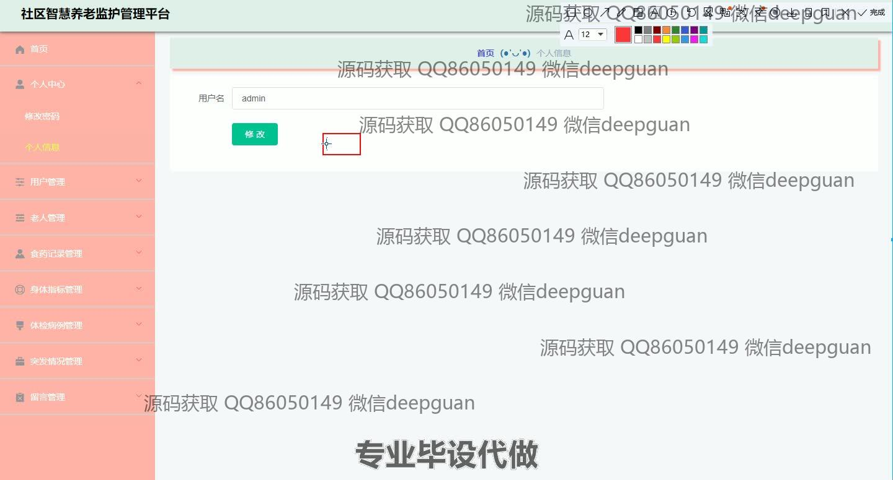

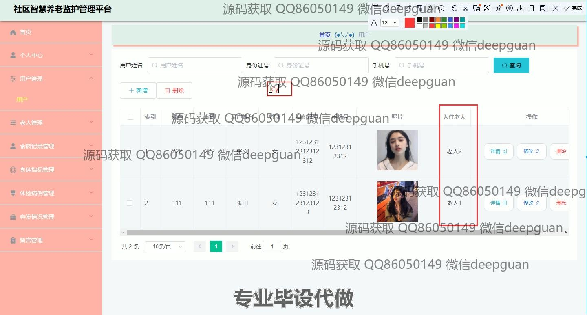
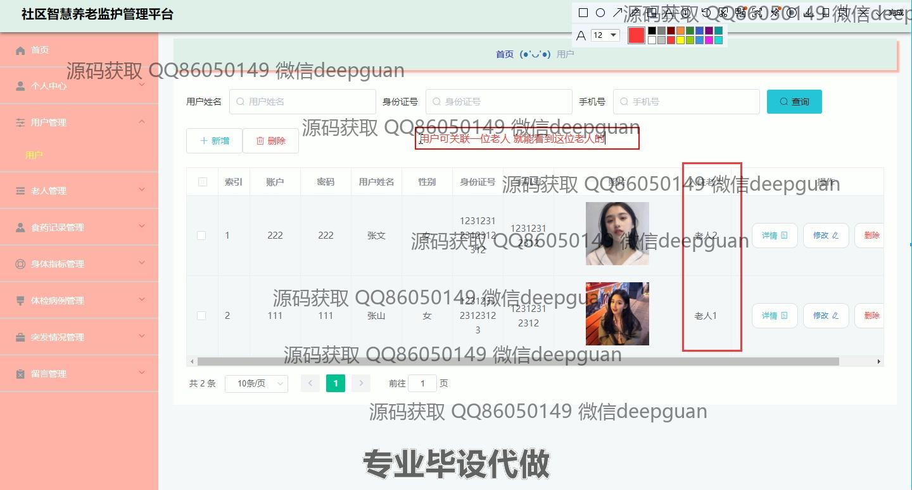
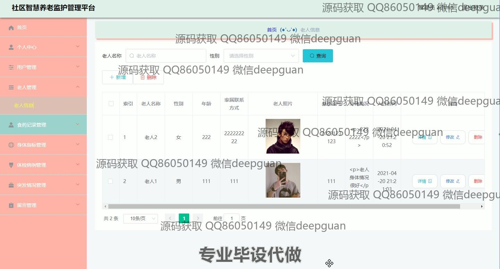
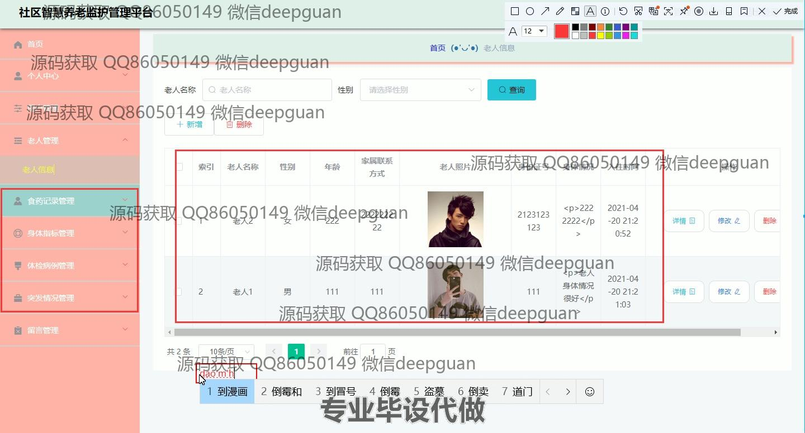
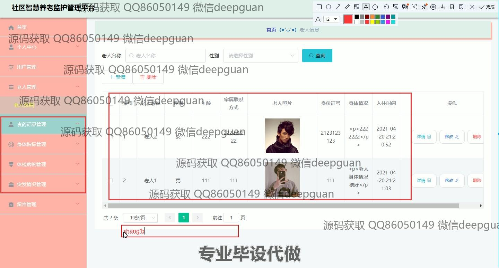
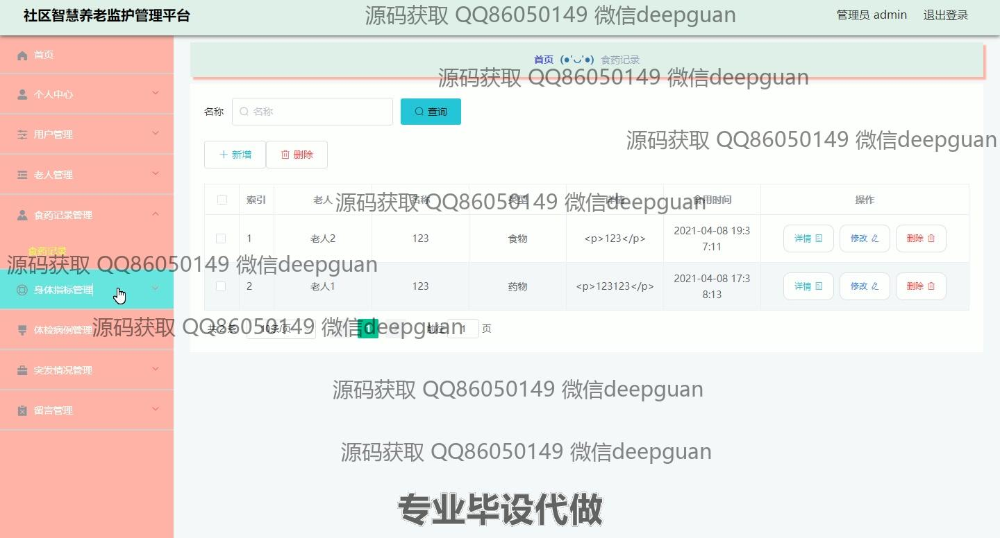
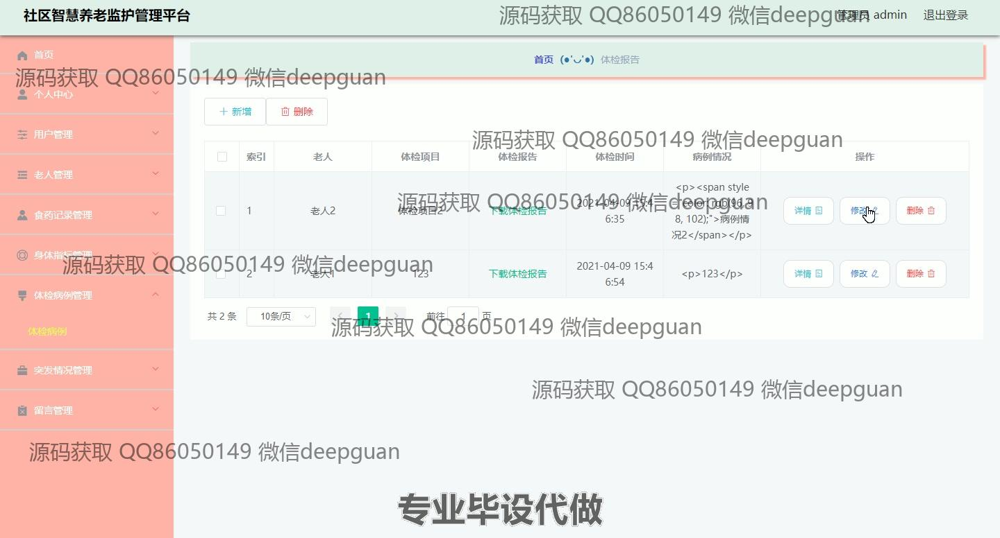
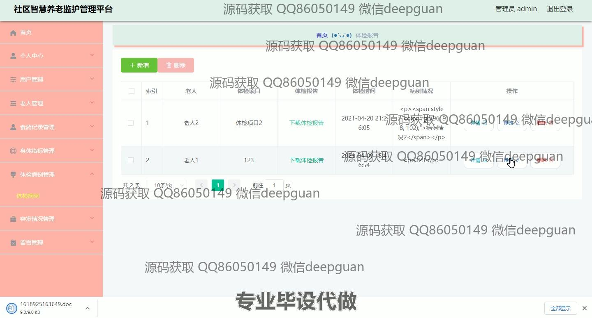
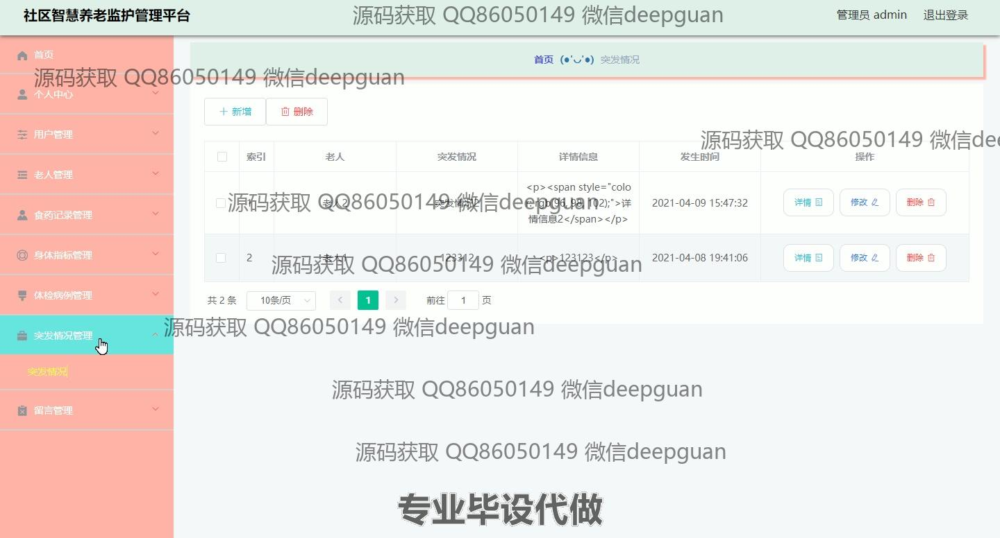

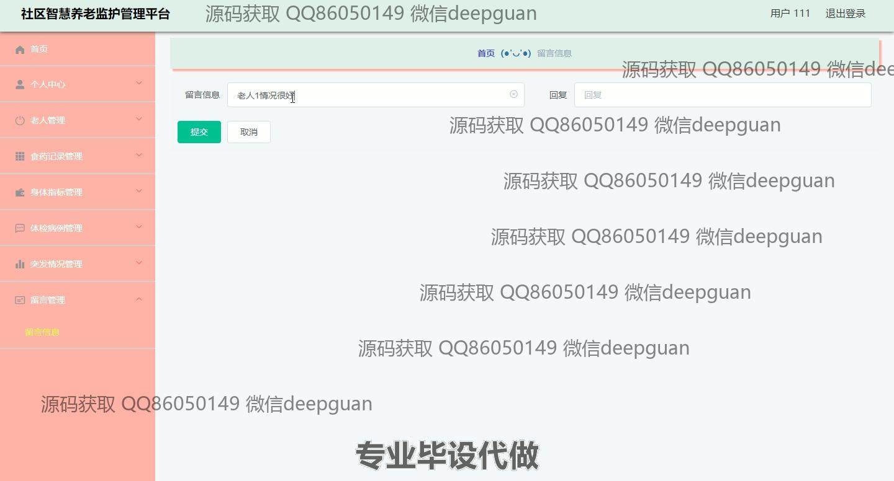
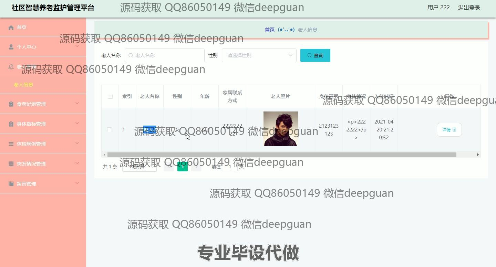
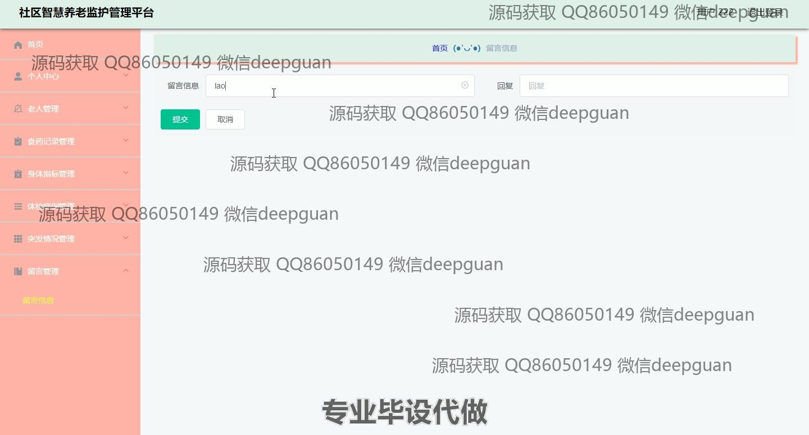
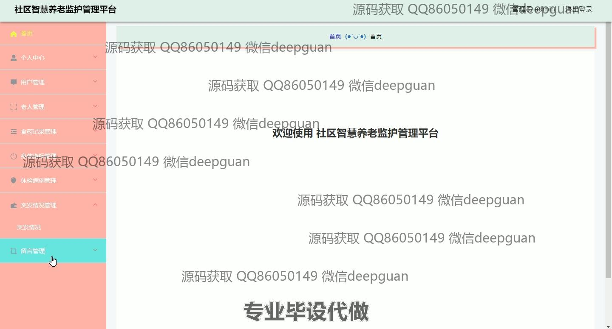
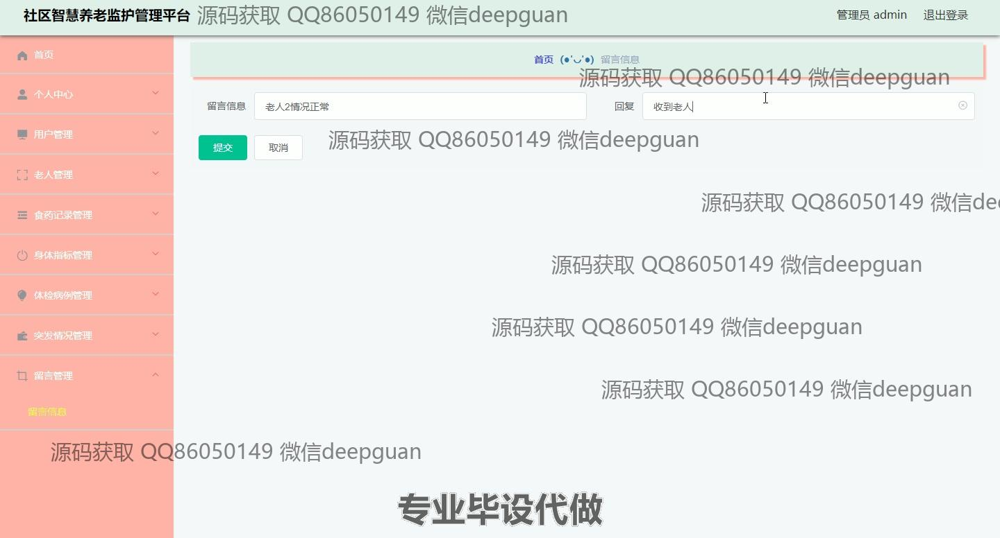
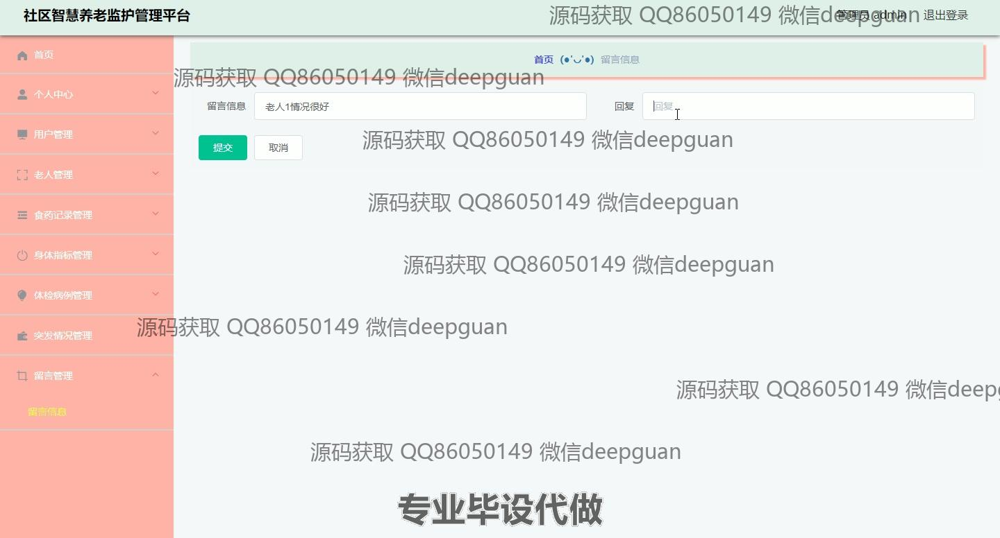

本代码来源于网络,仅供学习参考使用!

